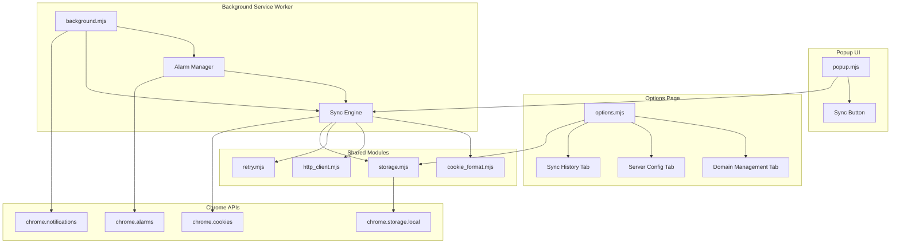

# Design Document: Cookie Remote Sync

## Overview

This design adds remote cookie synchronization to the "Get cookies.txt LOCALLY" browser extension. The feature allows users to push cookies from specific domains to configured remote servers via HTTP POST, with support for one-click manual sync, scheduled auto-sync via Chrome alarms, retry with exponential backoff, and a management UI.

The architecture maintains the existing vanilla JS (ES modules) approach with no runtime dependencies, leveraging Chrome Extension Manifest V3 APIs (alarms, storage.local, notifications) for background scheduling and persistence.

## Architecture



**Key Design Decisions:**

1. **Module-based architecture** — Each concern (sync, retry, storage, HTTP) is a separate ES module, keeping the service worker lean and testable.
2. **Storage as single source of truth** — All configuration and state lives in `chrome.storage.local`, making it accessible from both popup and background contexts.
3. **Alarm-per-domain pattern** — Each auto-synced domain gets its own Chrome alarm, allowing independent scheduling and cancellation.
4. **Simultaneous server delivery** — Primary and backup servers are hit in parallel via `Promise.allSettled`, so one failure doesn't block the other.

## Components and Interfaces

### 1. Sync Engine (`src/modules/sync_engine.mjs`)

The core orchestrator for sending cookie data to remote servers.

```javascript
/**
 * Sync cookies for a given domain to all configured servers.
 * @param {string} domain - The domain to sync cookies for
 * @param {Object} options
 * @param {boolean} options.includeRetry - Whether to use retry logic (default: true)
 * @returns {Promise<SyncResult>}
 */
export async function syncDomain(domain, options = {}) { }

/**
 * @typedef {Object} SyncResult
 * @property {boolean} success - Overall success (true if at least one server succeeded)
 * @property {ServerSyncResult[]} serverResults - Per-server results
 * @property {string} domain
 * @property {number} timestamp
 */

/**
 * @typedef {Object} ServerSyncResult
 * @property {string} serverId
 * @property {boolean} success
 * @property {number} statusCode
 * @property {string} [error]
 */
```

### 2. HTTP Client (`src/modules/http_client.mjs`)

A thin wrapper around `fetch` for sending sync requests.

```javascript
/**
 * POST cookie data to a remote server.
 * @param {string} url - Server URL
 * @param {string} cookieText - Cookie data in Netscape format
 * @param {string} authKey - Authorization key
 * @returns {Promise<{success: boolean, statusCode: number, error?: string}>}
 */
export async function postCookies(url, cookieText, authKey) { }
```

### 3. Retry Module (`src/modules/retry.mjs`)

Implements exponential backoff retry logic.

```javascript
/**
 * Execute a function with exponential backoff retry.
 * @param {() => Promise<{success: boolean}>} fn - The async function to retry
 * @param {RetryConfig} config
 * @returns {Promise<{success: boolean, attempts: number, lastError?: string}>}
 */
export async function withRetry(fn, config = DEFAULT_RETRY_CONFIG) { }

/**
 * @typedef {Object} RetryConfig
 * @property {number[]} intervals - Delay intervals in ms [60000, 120000, 240000]
 * @property {number} maxRetries - Maximum retry attempts (3)
 */
export const DEFAULT_RETRY_CONFIG = {
  intervals: [60_000, 120_000, 240_000],
  maxRetries: 3,
};
```

### 4. Storage Module (`src/modules/storage.mjs`)

Manages all chrome.storage.local operations with typed access.

```javascript
/** Domain sync entries */
export async function getDomainEntries() { }
export async function getDomainEntry(domain) { }
export async function saveDomainEntry(entry) { }
export async function removeDomainEntry(domain) { }

/** Server configurations */
export async function getServerConfigs() { }
export async function getServerConfig(id) { }
export async function saveServerConfig(config) { }
export async function removeServerConfig(id) { }
export async function getPrimaryServer() { }
export async function getBackupServer() { }

/** Sync logs */
export async function addSyncLog(logEntry) { }
export async function getSyncLogs(domain, limit) { }
export async function clearSyncLogs(domain) { }
```

### 5. Alarm Manager (within `src/background.mjs`)

Manages Chrome alarms for scheduled syncs.

```javascript
/**
 * Register an alarm for a domain's periodic sync.
 * Alarm name format: "sync:{domain}"
 * @param {string} domain
 */
function registerSyncAlarm(domain) { }

/**
 * Cancel an alarm for a domain.
 * @param {string} domain
 */
function cancelSyncAlarm(domain) { }

/**
 * Re-register alarms for all enabled domains on startup.
 */
function restoreAlarms() { }
```

### 6. Popup Sync UI (additions to `src/popup.mjs` and `src/popup.html`)

- Adds a "Sync" button to the export button container
- Handles click to trigger `syncDomain` for the current tab
- Shows success/error feedback via CSS class transitions

### 7. Options Page (`src/options.html`, `src/options.mjs`, `src/options.css`)

A full-page tabbed interface with three sections:
- **Domain Management** — List, add, remove, enable/disable domain sync entries
- **Server Configuration** — CRUD for server configs, primary/backup designation
- **Sync History** — Filterable log of sync attempts with status and timestamps

## Data Models

### DomainSyncEntry

Stored in `chrome.storage.local` with key `domain:{domainName}`.

```javascript
/**
 * @typedef {Object} DomainSyncEntry
 * @property {string} domain - The cookie domain (e.g., "example.com")
 * @property {boolean} enabled - Whether auto-sync is active
 * @property {number|null} lastSyncTime - Unix timestamp of last successful sync
 * @property {number} syncCount - Total successful sync count
 * @property {number} failureCount - Total permanently failed sync count
 * @property {number} consecutiveFailures - Count of consecutive permanent failures (resets on success)
 * @property {number} createdAt - Unix timestamp when entry was created
 */
```

### ServerConfiguration

Stored in `chrome.storage.local` with key `server:{id}`.

```javascript
/**
 * @typedef {Object} ServerConfiguration
 * @property {string} id - Unique identifier (crypto.randomUUID())
 * @property {string} label - User-friendly name for the server
 * @property {string} url - HTTPS endpoint URL
 * @property {string} authKey - Authorization key sent as header value
 * @property {'primary'|'backup'|'none'} role - Server role designation
 * @property {number} createdAt - Unix timestamp
 */
```

### SyncLogEntry

Stored in `chrome.storage.local` with key `log:{domain}:{timestamp}`.

```javascript
/**
 * @typedef {Object} SyncLogEntry
 * @property {string} domain - The synced domain
 * @property {number} timestamp - Unix timestamp of the attempt
 * @property {boolean} success - Whether the overall sync succeeded
 * @property {ServerSyncResult[]} serverResults - Per-server outcomes
 * @property {'manual'|'scheduled'} trigger - What initiated the sync
 */
```

### Storage Key Conventions

| Prefix | Example | Description |
|--------|---------|-------------|
| `domain:` | `domain:example.com` | Domain sync entry |
| `server:` | `server:a1b2c3d4` | Server configuration |
| `log:` | `log:example.com:1700000000` | Sync log entry |
| `meta:` | `meta:serverList` | Index/metadata records |

## Error Handling

### Network Errors

- **Timeout**: Fetch requests use a 30-second timeout via `AbortController`. Timeout is treated as a retriable failure.
- **DNS/Connection failures**: Caught as generic fetch errors. Retriable via exponential backoff.
- **HTTP 4xx**: Non-retriable (client error). Logged immediately without retry.
- **HTTP 5xx**: Retriable (server error). Subject to exponential backoff.

### Storage Errors

- **Quota exceeded**: If `chrome.storage.local` quota is reached, oldest sync logs are pruned. A warning is shown in the Options Page.
- **Concurrent access**: Storage writes use a read-modify-write pattern. Since the extension runs single-threaded per context, race conditions are minimal.

### Alarm Failures

- **Alarm not firing**: On each sync, the alarm manager verifies the alarm exists. If missing, it re-registers.
- **Service worker termination**: Chrome may terminate the service worker. Alarms persist across terminations and trigger `onAlarm`, reactivating the worker.

### User Feedback

- **Popup sync failure**: Brief error indicator (red flash + tooltip with error message)
- **Persistent auto-sync failures**: Chrome notification after 3 consecutive permanent failures per domain
- **No servers configured**: Sync button disabled with explanatory tooltip

## Correctness Properties

*A property is a characteristic or behavior that should hold true across all valid executions of a system — essentially, a formal statement about what the system should do. Properties serve as the bridge between human-readable specifications and machine-verifiable correctness guarantees.*

### Property 1: Sync dispatch sends to all configured servers with correct auth

*For any* set of configured servers (primary and/or backup) and *for any* authorization key string, when a sync is triggered, the Sync Engine SHALL send an HTTP POST request to every configured server, and each request SHALL include the server's authorization key as the "Authorization" header value.

**Validates: Requirements 1.3, 1.4**

### Property 2: Domain entry storage round-trip

*For any* valid domain name, creating a Domain_Sync_Entry and then retrieving it SHALL return an equivalent object; editing any field and saving SHALL persist the changes; removing an entry SHALL make it unretrievable. All entries SHALL be stored with the key format "domain:{domainName}".

**Validates: Requirements 2.6, 3.2, 3.3, 3.4**

### Property 3: Sync timestamp update

*For any* domain and *for any* completed sync operation, the Domain_Sync_Entry's lastSyncTime SHALL be updated to the sync completion timestamp, and syncCount SHALL increment by one on success.

**Validates: Requirements 2.3**

### Property 4: Disabled domains are skipped

*For any* Domain_Sync_Entry with enabled set to false, when a scheduled alarm fires for that domain, the Background_Service_Worker SHALL not invoke the Sync_Engine for that domain.

**Validates: Requirements 3.6**

### Property 5: Server configuration validation

*For any* input string, the server URL validation SHALL accept only strings that are valid HTTPS URLs (starting with "https://"), and the auth key validation SHALL reject empty strings and strings composed entirely of whitespace.

**Validates: Requirements 4.2**

### Property 6: Server role uniqueness invariant

*For any* sequence of server additions and role designations, at most one Server_Configuration SHALL hold the "primary" role and at most one SHALL hold the "backup" role at any point in time.

**Validates: Requirements 4.3, 4.4**

### Property 7: Server configuration storage round-trip

*For any* valid Server_Configuration object, saving it to storage and then retrieving it SHALL produce an equivalent object with all fields preserved.

**Validates: Requirements 4.5**

### Property 8: Exponential backoff timing and max retries

*For any* failing sync operation, the retry intervals SHALL follow the sequence [60000ms, 120000ms, 240000ms], and the total number of attempts SHALL never exceed 4 (1 initial + 3 retries). After the maximum retries are exhausted, no further retry attempts SHALL be made.

**Validates: Requirements 5.1, 5.2**

### Property 9: Retry counter independence and reset

*For any* sync operation targeting both Primary_Server and Backup_Server, each server's retry counter SHALL be independent — one server's failure SHALL not increment the other's counter. When a retry succeeds for a server, that server's retry counter SHALL reset to zero.

**Validates: Requirements 5.5, 5.6**

### Property 10: Failure logging completeness

*For any* permanently failed sync attempt (after all retries exhausted), the logged SyncLogEntry SHALL contain the domain name, a timestamp, a success value of false, and at least one server result with a non-empty error string.

**Validates: Requirements 5.3**

### Property 11: Domain list rendering completeness

*For any* array of Domain_Sync_Entry records, the rendered domain list SHALL display every entry's domain name, enabled status, last sync time, sync count, and failure count.

**Validates: Requirements 3.1**

## Testing Strategy

### Unit Tests

Unit tests cover the pure logic modules using example-based tests:

- **cookie_format.mjs** — Netscape format serialization correctness
- **retry.mjs** — Backoff timing, max retries, reset behavior (specific scenarios)
- **storage.mjs** — CRUD operations, key formatting, data integrity
- **http_client.mjs** — Request construction, header inclusion, error classification
- **sync_engine.mjs** — Orchestration logic, parallel dispatch, result aggregation

### Property-Based Tests

Property-based tests validate universal properties using **fast-check**:

- Each correctness property above maps to one property-based test
- Minimum 100 iterations per property test
- Each test is tagged with: **Feature: cookie-remote-sync, Property {N}: {title}**
- Tests use mocked Chrome APIs and fetch to isolate logic from infrastructure

### Integration Tests

- End-to-end sync flow with mocked fetch (1-2 representative scenarios)
- Alarm registration/cancellation lifecycle
- Options page CRUD operations against chrome.storage.local mock

### Test Framework

- **Vitest** for test runner (fast, ESM-native, good Chrome extension testing support)
- **fast-check** for property-based testing (minimum 100 iterations per property)
- **Manual mocks** for `chrome.*` APIs (chrome.storage.local, chrome.alarms, chrome.cookies, chrome.notifications)

