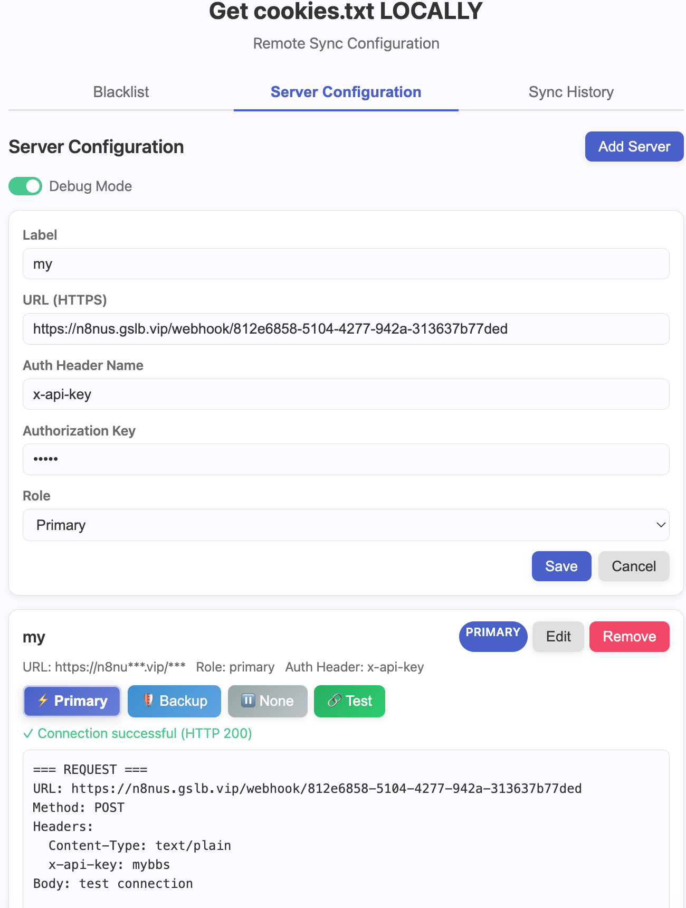
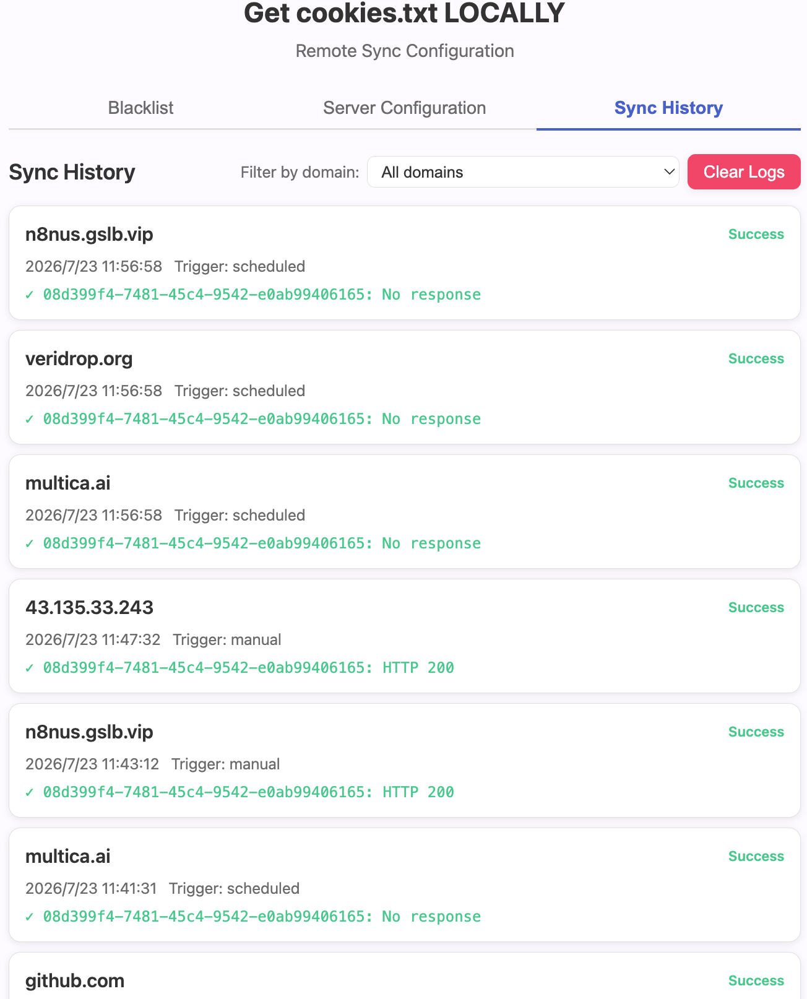
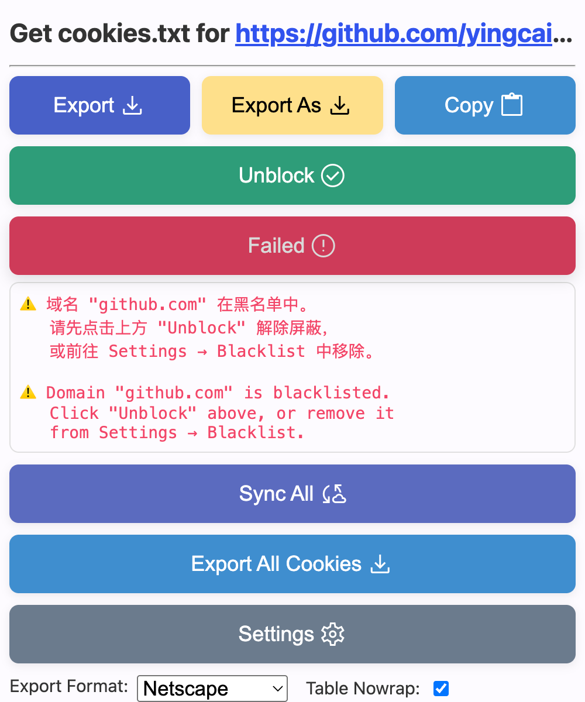
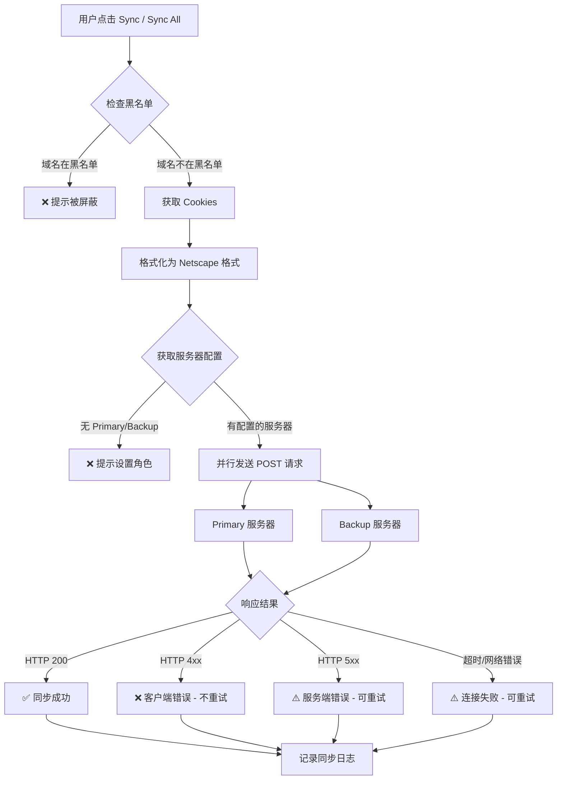

# Get cookies.txt LOCALLY

> 本地导出并远程同步浏览器 Cookies，安全开源，绝不外泄信息。


## ✨ 功能特性

- **导出 Cookies** — 支持 Netscape (.txt)、JSON、Header String 三种格式
- **复制到剪贴板** — 一键复制当前页面 Cookies
- **远程同步 (Sync)** — 将当前域名 Cookies 推送到自定义服务器
- **批量同步 (Sync All)** — 一次性同步所有域名的 Cookies（排除黑名单）
- **黑名单 (Blacklist)** — 屏蔽指定域名，Sync 和 Sync All 都不会同步
- **多服务器支持** — 主 (Primary) + 备 (Backup) 双服务器架构
- **自定义认证头** — 支持自定义 Header Name（如 `x-api-key`）
- **连接测试** — 一键测试服务器连通性
- **调试模式** — 查看完整请求/响应详情并可复制
- **自动定时同步** — 每 5 分钟自动同步已启用的域名
- **失败告警** — 连续失败 3 次自动弹出通知
- **暗色模式** — 自动适配系统暗色主题
- **开源透明** — 所有代码可审查，不含任何混淆

## 📸 截图

### Popup 主界面


### 服务器配置


### 同步历史


## 🔄 远程同步流程



### Sync vs Sync All

| 功能 | Sync | Sync All |
|------|------|----------|
| 范围 | 当前标签页域名 | 浏览器所有 Cookies |
| 请求次数 | 1 次 | 1 次（合并为单个请求） |
| 黑名单 | 检查当前域名 | 过滤所有黑名单域名的 Cookies |
| 触发方式 | 手动点击 | 手动点击 |

## 🚀 安装

### 从源码安装 (Chrome)

1. 克隆或下载本仓库
2. 打开 `chrome://extensions/`
3. 开启右上角「开发者模式」
4. 点击「加载已解压的扩展程序」
5. 选择项目的 `src/` 目录

### 从源码安装 (Firefox)

Firefox 需要合并 manifest 文件：
```bash
npm run build:firefox
```
然后在 `about:debugging` 中临时加载 `dist/` 中生成的 zip。

## 📖 使用指南

### 1. 导出 Cookies

- **Export** — 导出当前域名 Cookies 为文件
- **Export As** — 选择保存位置导出
- **Copy** — 复制到剪贴板
- **Export All Cookies** — 导出浏览器所有 Cookies

### 2. 配置远程服务器

1. 点击 Popup 中的 **Settings** 按钮
2. 切换到 **Server Configuration** 标签
3. 点击 **Add Server**，填写：
   - **Label** — 服务器名称（如 "My n8n Server"）
   - **URL (HTTPS)** — 接收 Cookies 的 HTTPS 端点
   - **Auth Header Name** — 认证头名称（默认 `Authorization`，可设为 `x-api-key` 等）
   - **Authorization Key** — 认证密钥
   - **Role** — 设置为 **Primary**（主服务器）
4. 点击 Save
5. 点击 **⚡ Primary** 按钮确认角色（按钮会有脉冲发光动画）
6. 点击 **🔗 Test** 验证连通性

> ⚠️ 必须至少设一个服务器为 Primary 或 Backup，否则 Sync 无法工作。

### 3. 同步 Cookies

- **Sync** — 同步当前标签页域名的 Cookies 到服务器
- **Sync All** — 同步所有域名 Cookies（排除黑名单），合并为一个请求发送

### 4. 黑名单管理

- 在 Popup 中点击 **Block** — 将当前域名加入黑名单
- 点击 **Unblock** — 从黑名单移除
- 或在 Settings → **Blacklist** 标签中管理

### 5. 调试模式

在 Settings → Server Configuration 中开启 **Debug Mode**：
- 点击 Test 时会显示完整的请求头、请求体、响应头、响应体
- 可一键复制调试信息

## 🔐 权限说明

| 权限 | 用途 |
|------|------|
| `activeTab` | 获取当前标签页 URL |
| `cookies` | 读取 Cookies（不写入、不发送到第三方） |
| `downloads` | 导出 Cookies 文件 |
| `storage` | 存储服务器配置、黑名单、同步日志 |
| `alarms` | 定时自动同步 |
| `notifications` | 同步失败告警通知 |
| `host_permissions` | 读取所有域名的 Cookies |

## 🛠 技术栈

- **Chrome Extension Manifest V3**
- **Vanilla JavaScript (ES Modules)** — 无运行时依赖
- **Vitest + fast-check** — 单元测试 + 属性测试
- **Biome** — 代码格式化和 Lint

## 🏗 开发

```bash
# 安装依赖
npm install

# 运行测试
npm test

# 代码检查
npm run check

# 自动修复格式
npm run fix

# 打包 Chrome 版本
npm run build:chrome

# 打包 Firefox 版本
npm run build:firefox
```

## 📄 License

MIT
